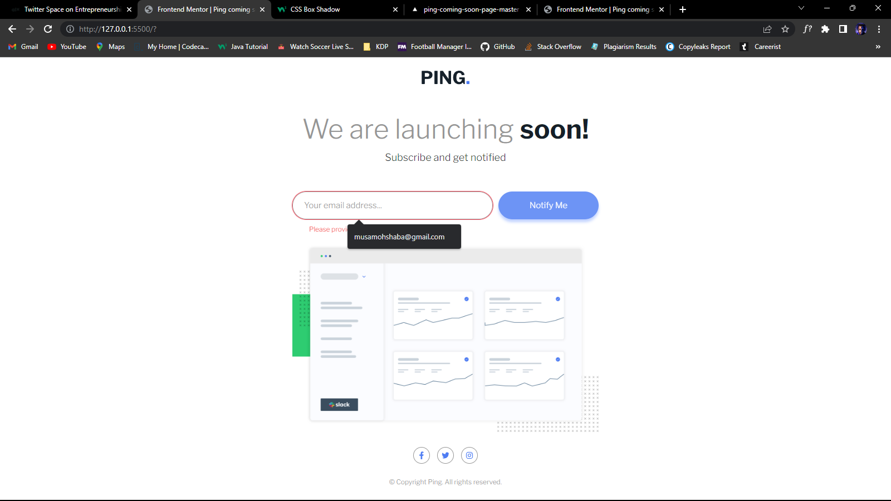
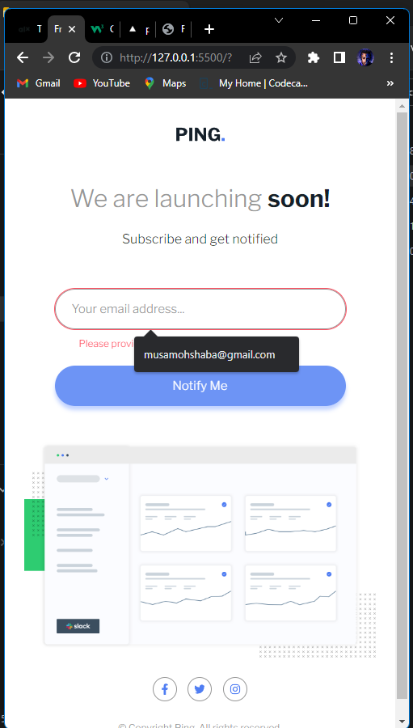

# Frontend Mentor - Ping coming soon page solution

This is a solution to the [Ping coming soon page challenge on Frontend Mentor](https://www.frontendmentor.io/challenges/ping-single-column-coming-soon-page-5cadd051fec04111f7b848da). Frontend Mentor challenges help you improve your coding skills by building realistic projects.

## Table of contents

- [Screenshot](#screenshot)
- [Links](#links)
- [My process](#my-process)
  - [Built with](#built-with)
- [Author](#author)

### Screenshot

### Links

- Solution URL: [Solution URL](https://github.com/walidshaba/ping-coming-soon-page-master.git)
- Live Site URL: [Live Site](https://ping-coming-soon-page-master-psi-three.vercel.app/)

## My process

### Built with

- Semantic HTML5 markup
- CSS custom properties
- Flexbox
- CSS Grid
- Desktop-First workflow
- Javascript

## Author

- Website - [My Website](https://www.your-site.com)
- Frontend Mentor - [@walidshaba](https://www.frontendmentor.io/profile/walidshaba)
- Twitter - [@codewithmshaba](https://www.twitter.com/codewithmshaba)
